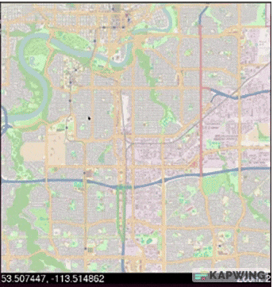

# Dijkstra Visualizer

## Overview
Dijkstra algorithm is implemented as the optimal path finder.

  

## Running instruction:
- Clone the repo "git clone https://github.com/xuanvietchu/GoogleMap_but_bad"
- Download GNOME Terminal: https://linux.softpedia.com/get/Terminals/gnome-terminal-12210.shtml (this allows us to run a command on a newly-opened terminal from the original terminal)
- "cd ./soln/server" using terminal
- run the "make" command
- "cd ../.." back to root dir
- run the "make" command
- Click 2 points on the map to choose the positions you want to find a route.
- Close the application by click the red x button on the top right

Demonstration video: https://youtu.be/rTe8pybwB_Y (not including step 0)
